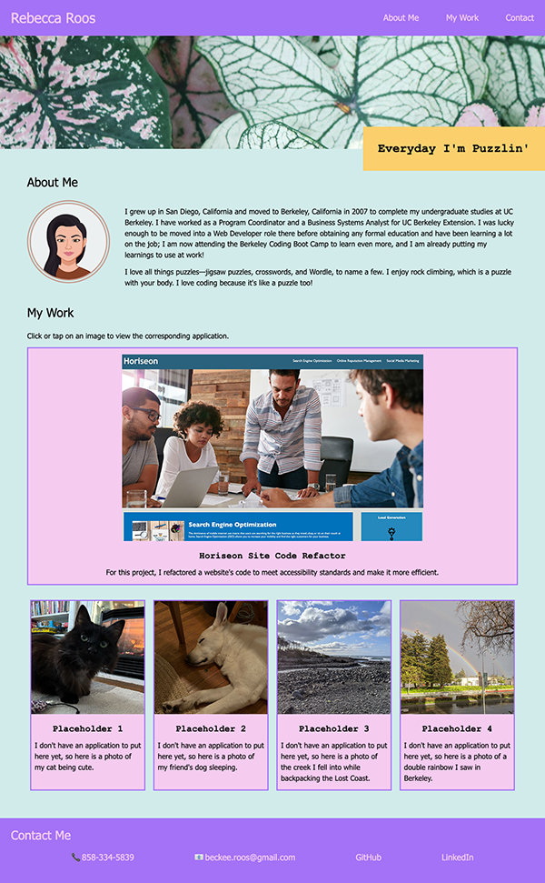

# My Portfolio

## Description

I created this website to showcase the applications I have built to potential employers, and to tell them a bit about me and how to contact me.

## Installation

N/A

## Usage

View the [deployed appliation](https://sendusyourbones.github.io/rebecca-portfolio/).

- To read a little about me, click the "About Me" link in the header or scroll down to the "About Me" section.
- To review my work, click the "My Work" link in the header or scroll down to the "My Work section. Click each image to navigate to each deployed application.
- To learn how to contact me or view my GitHub and LinkedIn profiles, click the "Contact" link in the header or scroll down to the "Contact Me" section.

## Credits

I obtained my CSS reset file from [meyerweb.com](http://meyerweb.com/eric/tools/css/reset/).

## License

MIT License